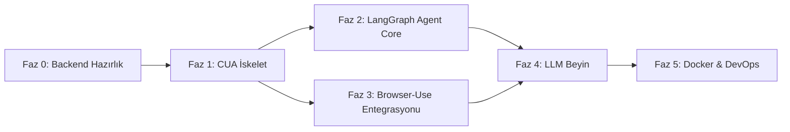

# CUA (Computer Using Agent) — Implementation Plan

Bu plan, mevcut 5-node'luk dağıtık haber analiz sistemine **6. düğüm olarak CUA**'yı eklemek için gereken tüm değişiklikleri 6 sıralı fazda tanımlar. Her faz bağımsız sub-agent görevlerine bölünmüştür.

---

## Faz Bağımlılık Grafiği



> [!IMPORTANT]
> **Faz 0 mutlaka ilk sırada tamamlanmalıdır.** Orchestrator ve DB güncellemeleri yapılmadan CUA kodu çalışamaz. Faz 2 ve Faz 3 birbirine paralel yürütülebilir.

---

## Faz 0: Backend Hazırlık (Mevcut Sistem Güncellemeleri)

Bu fazda **hiçbir yeni dosya oluşturulmaz**, sadece mevcut dosyalar güncellenir. CUA'nın sisteme bağlanabilmesi, görev alabilmesi ve DB'ye yazabilmesi için altyapı hazırlanır.

---

### Sub-Task 0.1: NodeType Enum Güncelleme

**Dosya:** [node_registry.py](file:///C:/Users/HP/Desktop/Projeler/Bitirme/orchestrator/services/node_registry.py)

**Değişiklik:**
```diff
 class NodeType(Enum):
     CRAWLER = "crawler"
     DB = "db"
     VLM = "vlm"
     LLM = "llm"
+    CUA = "cua"
```

**Satır Aralığı:** 13-17
**Kabul Kriteri:** `NodeRegistry.register("cua", "host", 50054)` çağrısı başarılı olmalı, geçersiz tip hatası vermemeli.

---

### Sub-Task 0.2: RabbitMQ Kuyruk Tanımları

**Dosya:** [config.py](file:///C:/Users/HP/Desktop/Projeler/Bitirme/orchestrator/config.py)

**Değişiklik:**
```diff
 QUEUE_LLM_RESULTS = 'llm_results'
 QUEUE_DB_TASKS = 'db_tasks'
+QUEUE_AGENT_TASKS = 'agent_tasks'
+QUEUE_AGENT_RESULTS = 'agent_results'
```

**Satır Aralığı:** 20-25

---

**Dosya:** [rabbitmq_manager.py](file:///C:/Users/HP/Desktop/Projeler/Bitirme/orchestrator/services/rabbitmq_manager.py)

**Değişiklikler:**
1. `_queues` listesine `QUEUE_AGENT_TASKS` ve `QUEUE_AGENT_RESULTS` eklenmeli (Satır 46-52)
2. Yeni helper metot eklenmeli:

```python
def publish_agent_task(self, task_id: str, json_data: str) -> bool:
    """Publish a task to CUA agent queue."""
    msg = QueueMessage(task_id=task_id, json_data=json_data)
    return self.publish(QUEUE_AGENT_TASKS, msg)
```

**Kabul Kriteri:** RabbitMQ bağlantısı kurulduğunda `agent_tasks` ve `agent_results` kuyrukları otomatik oluşturulmalı.

---

### Sub-Task 0.3: PipelineManager CUA Entegrasyonu

**Dosya:** [pipeline_manager.py](file:///C:/Users/HP/Desktop/Projeler/Bitirme/orchestrator/services/pipeline_manager.py)

**Değişiklikler:**

1.  **PipelineStage Enum'a yeni aşamalar:**
```diff
 class PipelineStage(Enum):
     CRAWLED = "crawled"
     STORED = "stored"
     VLM_ANALYZING = "vlm_analyzing"
     VLM_COMPLETE = "vlm_complete"
     LLM_ANALYZING = "llm_analyzing"
     COMPLETE = "complete"
     FAILED = "failed"
+    AGENT_SURFACE = "agent_surface"
+    AGENT_RESEARCH = "agent_research"
+    AGENT_COMPLETE = "agent_complete"
```

2.  **Fan-Out mantığı** — `on_crawl_complete` metodunun sonuna CUA kontrolü:
```python
def _fan_out_to_cua(self, keywords: str):
    """If CUA is online, send parallel surface task."""
    cua_node = self.registry.get_idle_node(NodeType.CUA)
    if cua_node and self.rabbitmq:
        import json
        task_data = json.dumps({
            "mode": "surface",
            "query": keywords,
            "params": {"max_articles": 10, "max_searches": 5}
        })
        task_id = self.generate_task_id()
        self.rabbitmq.publish_agent_task(task_id, task_data)
        print(f"[Pipeline] Fan-out to CUA: {task_id}")
```

3.  **CUA sonuç işleme metotları:**
```python
def on_agent_surface_complete(self, task_id: str, json_data: str):
    """Handle CUA Mode 1 result — feed into existing VLM→LLM pipeline."""
    # Her haber öğesi için ayrı pipeline task oluştur
    ...

def on_agent_research_complete(self, task_id: str, json_data: str):
    """Handle CUA Mode 2 result — store directly as research mission."""
    # DB'ye research_missions tablosuna yaz
    ...
```

**Kabul Kriteri:** `start_crawl()` çağrıldığında idle CUA varsa `agent_tasks`'a mesaj düşmeli.

---

### Sub-Task 0.4: Orchestrator main.py Güncellemesi

**Dosya:** [main.py](file:///C:/Users/HP/Desktop/Projeler/Bitirme/orchestrator/main.py)

**Değişiklikler:**

1.  **Import'a `QUEUE_AGENT_RESULTS` eklenmeli** (Satır 13-16)

2.  **`_result_queue_poller`'a `agent_results` dinleme** eklenmeli (Satır 95-120):
```python
# Check Agent results
agent_msg = self.rabbitmq.get_message(QUEUE_AGENT_RESULTS)
if agent_msg:
    print(f"[Orchestrator] Agent result received: {agent_msg.task_id}")
    result_data = json.loads(agent_msg.json_data)
    mode = result_data.get("mode", "surface")
    if mode == "surface":
        self.pipeline.on_agent_surface_complete(agent_msg.task_id, agent_msg.json_data)
    else:
        self.pipeline.on_agent_research_complete(agent_msg.task_id, agent_msg.json_data)
```

3.  **`_command_loop`'a yeni CLI komutları** eklenmeli (Satır 209):
```python
elif cmd.startswith("research "):
    topic = cmd[9:].strip()
    # Queue a deep research task
    ...
    print(f"[Orchestrator] Research task queued: {topic}")
```

**Kabul Kriteri:** `status` komutu CUA node'larını göstermeli. `research <topic>` komutu `agent_tasks`'a mesaj atmalı.

---

### Sub-Task 0.5: Proto Yorumları ve compile_proto.py

**Dosya:** [orchestrator.proto](file:///C:/Users/HP/Desktop/Projeler/Bitirme/proto/orchestrator.proto)

**Değişiklik:** Proto'da yapısal değişiklik yok (RabbitMQ kullanıyoruz). Sadece yorum güncellemesi:
```diff
 message RegisterRequest {
-  string node_type = 1;  // "crawler", "vlm", "llm", "db"
+  string node_type = 1;  // "crawler", "vlm", "llm", "db", "cua"
   string host = 2;
   int32 port = 3;
 }
```

**Dosya:** [compile_proto.py](file:///C:/Users/HP/Desktop/Projeler/Bitirme/compile_proto.py)

**Değişiklik:**
```diff
-NODES = ['orchestrator', 'crawler', 'db', 'vlm', 'llm']
+NODES = ['orchestrator', 'crawler', 'db', 'vlm', 'llm', 'cua']
```

**Satır:** 10

**Sonra çalıştırılacak komut:** `python compile_proto.py`

---

### Sub-Task 0.6: PostgreSQL Şema Güncellemeleri

**Dosya:** [postgres_manager.py](file:///C:/Users/HP/Desktop/Projeler/Bitirme/db/services/postgres_manager.py)

**Değişiklikler:**

1.  **`_init_tables` metoduna yeni kolonlar ve tablo** (Satır 102-164):

```sql
-- news tablosuna eklemeler (mevcut CREATE TABLE'ın sonuna)
ALTER TABLE news ADD COLUMN IF NOT EXISTS source_type VARCHAR(20) DEFAULT 'crawler';
ALTER TABLE news ADD COLUMN IF NOT EXISTS mission_id VARCHAR(64);

-- Yeni tablo: research_missions
CREATE TABLE IF NOT EXISTS research_missions (
    mission_id VARCHAR(64) PRIMARY KEY,
    topic TEXT NOT NULL,
    status VARCHAR(20) DEFAULT 'in_progress',
    final_report_json JSONB,
    graph_state_json JSONB,
    findings_count INTEGER DEFAULT 0,
    confidence_score FLOAT,
    created_at TIMESTAMP DEFAULT CURRENT_TIMESTAMP,
    completed_at TIMESTAMP
);

CREATE INDEX IF NOT EXISTS idx_news_mission ON news(mission_id);
CREATE INDEX IF NOT EXISTS idx_research_status ON research_missions(status);
```

2.  **Yeni metotlar:**
```python
async def insert_research_mission(self, mission_data: dict) -> str:
    """Create a new research mission record."""
    ...

async def complete_research_mission(self, mission_id: str, report: dict, state: dict):
    """Finalize a research mission with report and graph state."""
    ...
```

**Kabul Kriteri:** DB başlatıldığında `research_missions` tablosu oluşturulmalı. `news` tablosunda `source_type` ve `mission_id` kolonları var olmalı.

---

## Faz 1: CUA İskelet Yapısı (Yeni Node Oluşturma)

Bu fazda `/cua` dizini altında diğer node'larla paralel bir yapı oluşturulur. Henüz ajan mantığı yok, sadece "sisteme bağlanıp heartbeat atan boş bir kutu".

---

### Sub-Task 1.1: CUA Dizin Yapısı

Oluşturulacak dosyalar:

```
cua/
├── __init__.py
├── main.py                    # Ana giriş, RabbitMQ dinle + heartbeat
├── config.py                  # Env vars (model, orchestrator, rabbitmq)
├── handoff_cua.md             # ✅ Zaten mevcut
├── requirements.txt           # langchain, langgraph, browser-use, playwright, transformers, torch, pika, grpcio
├── Dockerfile                 # Multi-stage build (Chromium + CUDA)
├── services/
│   ├── __init__.py
│   ├── grpc_client.py         # Register & Heartbeat (crawler/llm pattern kopyala)
│   └── rabbitmq_consumer.py   # agent_tasks dinle, agent_results yayınla
├── proto/                     # compile_proto.py otomatik dolduracak
│   └── orchestrator.proto
└── generated/                 # compile_proto.py otomatik dolduracak
    └── __init__.py
```

**Kaynak Referans:** `crawler/services/grpc_client.py` ve `llm/services/rabbitmq_consumer.py` pattern olarak kullanılacak.

### Sub-Task 1.2: config.py

```python
"""CUA Node Configuration"""
import os
from dotenv import load_dotenv
load_dotenv()

# Orchestrator
ORCHESTRATOR_HOST = os.getenv('ORCHESTRATOR_HOST', 'localhost')
ORCHESTRATOR_PORT = int(os.getenv('ORCHESTRATOR_PORT', '50051'))
CUA_GRPC_PORT = int(os.getenv('CUA_GRPC_PORT', '50054'))

# RabbitMQ
RABBITMQ_HOST = os.getenv('RABBITMQ_HOST')
RABBITMQ_PORT = int(os.getenv('RABBITMQ_PORT', '5672'))
RABBITMQ_USER = os.getenv('RABBITMQ_USER', 'guest')
RABBITMQ_PASSWORD = os.getenv('RABBITMQ_PASSWORD', 'guest')
QUEUE_AGENT_TASKS = 'agent_tasks'
QUEUE_AGENT_RESULTS = 'agent_results'

# LLM Brain
MODEL_MODE = os.getenv('MODEL_MODE', 'local')         # "local" (LM Studio) | "production" (Qwen3.5-9B)
MODEL_NAME = os.getenv('MODEL_NAME', 'Qwen/Qwen3.5-9B-Instruct')
LMSTUDIO_URL = os.getenv('LMSTUDIO_URL', 'http://localhost:1234/v1')

# Agent Settings
DEFAULT_SEARCH_ENGINE = os.getenv('SEARCH_ENGINE', 'google')  # "google" | "duckduckgo"
MAX_ARTICLES_DEFAULT = int(os.getenv('MAX_ARTICLES', '10'))
MAX_SEARCHES_DEFAULT = int(os.getenv('MAX_SEARCHES', '5'))
RESEARCH_CONFIDENCE_THRESHOLD = float(os.getenv('CONFIDENCE_THRESHOLD', '0.80'))
MAX_RESEARCH_CYCLES = int(os.getenv('MAX_RESEARCH_CYCLES', '15'))
```

### Sub-Task 1.3: main.py (İskelet)

```python
"""CUA Node Main Entry Point"""
import asyncio, json, signal, sys
from cua.config import *
from cua.services.grpc_client import GRPCClient
from cua.services.rabbitmq_consumer import RabbitMQConsumer

class CUANode:
    def __init__(self):
        self.grpc_client = GRPCClient(ORCHESTRATOR_HOST, ORCHESTRATOR_PORT)
        self.rabbitmq = RabbitMQConsumer()
        self.node_id = None
        self._running = False

    async def start(self):
        # 1. Register with Orchestrator
        self.node_id = await self.grpc_client.register("cua", CUA_GRPC_PORT)
        # 2. Start heartbeat loop
        asyncio.create_task(self._heartbeat_loop())
        # 3. Start consuming agent_tasks
        asyncio.create_task(self._task_consumer_loop())
        self._running = True

    async def _task_consumer_loop(self):
        while self._running:
            msg = self.rabbitmq.get_message(QUEUE_AGENT_TASKS)
            if msg:
                task_data = json.loads(msg.json_data)
                mode = task_data.get("mode", "surface")
                if mode == "surface":
                    result = await self._run_surface(task_data)
                else:
                    result = await self._run_research(task_data)
                # Publish result
                self.rabbitmq.publish_result(msg.task_id, result)
            await asyncio.sleep(1)

    async def _run_surface(self, task_data): ...  # Faz 2'de doldurulacak
    async def _run_research(self, task_data): ... # Faz 2'de doldurulacak
```

**Kabul Kriteri:** `python -m cua.main` çalıştırıldığında Orchestrator'da `cua_XXXXXXXX` olarak kayıt olmalı ve heartbeat görülmeli.

---

## Faz 2: LangGraph Agent Core

Bu fazda ajanın "beyni" olan LangGraph durum makinesi kodlanır. Henüz gerçek tarayıcı veya LLM yok, mock fonksiyonlarla çalışır.

---

### Sub-Task 2.1: Agent State Tanımı

**Dosya:** `cua/agent/state.py` [YENİ]

```python
from typing import TypedDict, Literal, Optional
from langgraph.graph import MessagesState

class AgentState(TypedDict):
    # Görev bilgisi
    mode: Literal["surface", "research"]
    query: str
    params: dict                    # max_articles, max_searches, vb.

    # Navigasyon durumu
    visited_urls: list[str]         # Ziyaret edilen URL'ler
    exclude_urls: list[str]         # Orchestrator'dan gelen exclude list

    # Bulgular (findings)
    collected_articles: list[dict]  # Mode 1: toplanan haber nesneleri
    findings: list[dict]            # Mode 2: araştırma bulguları
    current_hypothesis: str         # Mode 2: mevcut hipotez/yön

    # Kontrol
    cycle_count: int                # Döngü sayacı
    confidence: float               # Mode 2: self-evaluation skoru (0.0-1.0)
    should_stop: bool               # Döngü sonlandırma bayrağı
    final_report: Optional[dict]    # Sentezlenmiş çıktı
```

---

### Sub-Task 2.2: LangGraph Döngüsel Graph

**Dosya:** `cua/agent/graph.py` [YENİ]

```
Plan ──→ Execute ──→ Evaluate ──→ (Yeterli mi?)
  ↑                                    |
  └──── Hayır ←────────────────────────┘
                                       |
                                 Evet → Synthesize → END
```

Nodeler:
1.  **plan_node:** Hangi aramayı yapacağına, hangi siteye gireceğine karar verir. LLM tool-call kullanır.
2.  **execute_node:** Browser-Use ile sayfaya gider, içeriği çeker, makaleyi parse eder.
3.  **evaluate_node:**
    -   Mode 1: `len(collected_articles) >= max_articles` → dur
    -   Mode 2: LLM self-evaluation → `confidence >= threshold` → dur
4.  **synthesize_node:** Mode 2'de tüm findings'i bir rapor haline getirir. Mode 1'de no-op.

**Conditional edges:** `evaluate → plan` (devam) veya `evaluate → synthesize` (bitir)

---

### Sub-Task 2.3: Mode Routing

**Dosya:** `cua/agent/graph.py` içinde

```python
def create_agent_graph(mode: str):
    """Factory: mod'a göre graph oluştur"""
    if mode == "surface":
        return _build_surface_graph()
    else:
        return _build_research_graph()
```

İki graph yapısal olarak aynı, fark sadece `evaluate_node` içindeki mantıkta.

---

## Faz 3: Browser-Use Entegrasyonu

Bu fazda ajanın "eli-ayağı" olan tarayıcı aracı entegre edilir.

---

### Sub-Task 3.1: Browser-Use Setup

**Dosya:** `cua/agent/browser_tool.py` [YENİ]

```python
from browser_use import Agent, Browser, BrowserConfig

class BrowserTool:
    def __init__(self, headless=True):
        self.browser = Browser(config=BrowserConfig(headless=headless))

    async def search_google(self, query: str) -> list[dict]:
        """Google'da arama yap, sonuç linklerini döndür"""
        ...

    async def search_duckduckgo(self, query: str) -> list[dict]:
        """DuckDuckGo (fallback) arama"""
        ...

    async def extract_page_content(self, url: str) -> dict:
        """Sayfaya git, metin + görsel URL'lerini çıkar"""
        ...

    async def take_screenshot(self) -> bytes:
        """Vision modu için screenshot al"""
        ...

    async def close(self):
        await self.browser.close()
```

**Hybrid Mantık:**
- Varsayılan: DOM okuma (hızlı, ucuz)
- Captcha/bot detection algılandığında: screenshot al → VLM/LLM modeline gönder → koordinat ile tıklayarak çöz

---

### Sub-Task 3.2: Search Strategy

**Dosya:** `cua/agent/search_strategy.py` [YENİ]

```python
class SearchStrategy:
    def generate_queries(self, topic: str, mode: str, existing_findings: list) -> list[str]:
        """Konu ve mevcut bulguları değerlendirerek farklılaştırılmış arama sorguları üret"""
        # Mode 1: baseline sorgular ("Turkey economy news", "Türkiye ekonomi son dakika")
        # Mode 2: LLM ile dinamik sorgu üretimi (mevcut findings'e dayanarak yönelim)
```

---

### Sub-Task 3.3: Content Extractor

**Dosya:** `cua/agent/content_extractor.py` [YENİ]

Sayfadan çıkarılan veri, mevcut Crawler'ın ürettiği JSON formatıyla **tam uyumlu** olmalı:

```json
{
    "source": "bbc.com",
    "country": "uk",
    "url": "https://...",
    "keyword_found": "turkey",
    "scraped_at": "2026-04-13T...",
    "content": "Article text...",
    "media": {
        "main_image": "https://...",
        "content_images": ["https://..."],
        "videos": []
    }
}
```

> [!WARNING]
> Bu format mevcut pipeline'ın (VLM → LLM → DB) beklediği formatla birebir aynı olmalıdır. Aksi halde downstream node'lar crash eder. Referans: `crawler/main.py`'deki çıktı yapısı.

---

## Faz 4: LLM Beyin Entegrasyonu

Bu fazda ajanın "düşünme" yeteneği, yani plan yapma, self-evaluation ve sentez yetenekleri eklenir.

---

### Sub-Task 4.1: Model Handler

**Dosya:** `cua/agent/model_handler.py` [YENİ]

```python
class CUAModelHandler:
    """CUA'nın karar verme motoru"""

    def __init__(self, mode: str = "local"):
        if mode == "local":
            # LM Studio OpenAI-compat API
            from langchain_openai import ChatOpenAI
            self.llm = ChatOpenAI(
                base_url=LMSTUDIO_URL,
                model="local-model",
                temperature=0.3
            )
        else:
            # Production: Qwen3.5-9B local transformer
            from langchain_community.llms import HuggingFacePipeline
            ...

    def plan_next_action(self, state: AgentState) -> dict:
        """Mevcut state'e bakarak bir sonraki adıma karar ver"""
        ...

    def evaluate_confidence(self, state: AgentState) -> float:
        """Self-evaluation: 0.0-1.0 arası confidence skoru"""
        ...

    def synthesize_report(self, state: AgentState) -> dict:
        """Tüm findings'i son rapor haline getir"""
        ...
```

---

### Sub-Task 4.2: Tool Definitions

**Dosya:** `cua/agent/tools.py` [YENİ]

LangGraph'ın `plan_node`'unun çağırabileceği tool tanımları:

```python
from langchain_core.tools import tool

@tool
def search_web(query: str) -> list[dict]:
    """Search the web for a query and return results."""
    ...

@tool
def visit_page(url: str) -> dict:
    """Visit a URL and extract article content and images."""
    ...

@tool
def mark_complete() -> str:
    """Signal that current task is complete."""
    ...
```

---

### Sub-Task 4.3: System Prompts

**Dosya:** `cua/agent/prompts.py` [YENİ]

```python
SURFACE_PLAN_PROMPT = """You are a news discovery agent...
Given: current collected articles, visited URLs, and the search topic.
Decide: what search query to run next OR which result page to visit.
Output: a tool call (search_web or visit_page)."""

RESEARCH_PLAN_PROMPT = """You are a deep intelligence agent...
Given: current findings, hypothesis, visited URLs.
Decide: refine hypothesis, search for corroborating/contradicting evidence.
Output: a tool call."""

EVALUATE_PROMPT = """Rate your confidence (0.0-1.0) that you have gathered
sufficient information to write a comprehensive report on the topic: {topic}
Current findings: {findings_summary}"""

SYNTHESIZE_PROMPT = """Based on the following findings, write a structured
intelligence report..."""
```

---

## Faz 5: Docker, DevOps ve Dokümantasyon

---

### Sub-Task 5.1: Dockerfile (Multi-Stage)

**Dosya:** `cua/Dockerfile` [YENİ]

```dockerfile
# Stage 1: Browser dependencies
FROM python:3.11-slim AS browser-base
RUN apt-get update && apt-get install -y \
    chromium chromium-driver \
    && rm -rf /var/lib/apt/lists/*
RUN pip install playwright && playwright install chromium

# Stage 2: CUDA + Python deps
FROM nvidia/cuda:12.1.0-runtime-ubuntu22.04 AS runtime
COPY --from=browser-base /usr/bin/chromium /usr/bin/chromium
# ... GPU model requirements + browser-use
COPY cua/requirements.txt .
RUN pip install -r requirements.txt
COPY . /app
WORKDIR /app
CMD ["python", "-m", "cua.main"]
```

> [!CAUTION]
> GPU + Chromium aynı container'da olacağından image boyutu ~15-20 GB olabilir. Prod'da multi-stage build ile optimize edilmeli.

---

### Sub-Task 5.2: docker-compose.yml Güncelleme

**Dosya:** [docker-compose.yml](file:///C:/Users/HP/Desktop/Projeler/Bitirme/docker-compose.yml)

```yaml
  cua:
    build:
      context: .
      dockerfile: cua/Dockerfile
    container_name: cua
    depends_on:
      - orchestrator
    deploy:
      resources:
        reservations:
          devices:
            - driver: nvidia
              count: 1
              capabilities: [gpu]
    environment:
      - ORCHESTRATOR_HOST=orchestrator
      - ORCHESTRATOR_PORT=50051
      - RABBITMQ_HOST=rabbitmq
      - MODEL_MODE=production
    networks:
      - bitirme-net
```

---

### Sub-Task 5.3: Deployment Script

**Dosya:** `scripts/6_cua.ps1` [YENİ]

Mevcut `5_llm.ps1` pattern'ı izlenerek oluşturulacak. Vast.ai'dan GPU instance seçimi, WireGuard bağlantısı ve Docker run komutlarını içerecek.

---

### Sub-Task 5.4: compile_proto.py & Dokümantasyon

-  `compile_proto.py` çalıştırılacak → CUA için proto dosyaları oluşturulacak
-  `handoff_all.md` güncellenmeli (6. modül olarak CUA eklenmeli)
-  `handoff_files.md` güncellenmeli (CUA dizini eklenmeli)

---

## Verification Plan (Doğrulama)

### Otomatik Testler

| Test | Komut | Beklenen Sonuç |
|---|---|---|
| Proto derleme | `python compile_proto.py` | 6/6 node başarılı |
| Orchestrator başlatma | `python -m orchestrator.main` | `agent_tasks` kuyruğu oluşturulmalı |
| CUA kayıt | `python -m cua.main` | `cua_XXXXXXXX` node_id almalı |
| Mode 1 fan-out | Orchestrator CLI → `start` | `agent_tasks`'a mesaj düşmeli |
| Mode 2 tetikleme | Orchestrator CLI → `research Turkey crisis` | `agent_tasks`'a research görevi düşmeli |
| DB tablo kontrolü | `check_db.py` | `research_missions` tablosu mevcut olmalı |

### Manuel Doğrulama (Lokal LM Studio ile)
1. LM Studio'da 4B model aç
2. CUA'yı `MODEL_MODE=local` ile başlat
3. Orchestrator'dan `research "Turkey economic outlook 2026"` tetikle
4. CUA'nın Google'da arama yapıp, sitelere girip, rapor üretip `agent_results`'a döndüğünü gözlemle

---

## Open Questions

> [!IMPORTANT]
> 1. **Browser-Use lisansı:** Browser-Use MIT lisanslı. Bitirme projesi kapsamında ticari kullanım endişesi yok ama jüri sorabilir — not edilmeli.
> 2. **Qwen3.5-9B VRAM gereksinimi:** 8-bit quantize ile ~10-12 GB VRAM. Vast.ai'da RTX 3090 (24GB) yeterli olacak mı? (Browser-Use Chromium da RAM yer). Düşük durumda 4-bit quantize'a düşülebilir.
> 3. **Rate Limiting:** Google arama yoğunluğu. Çok sık aramada CAPTCHA. `SEARCH_DELAY` parametresi eklemeli miyiz?
